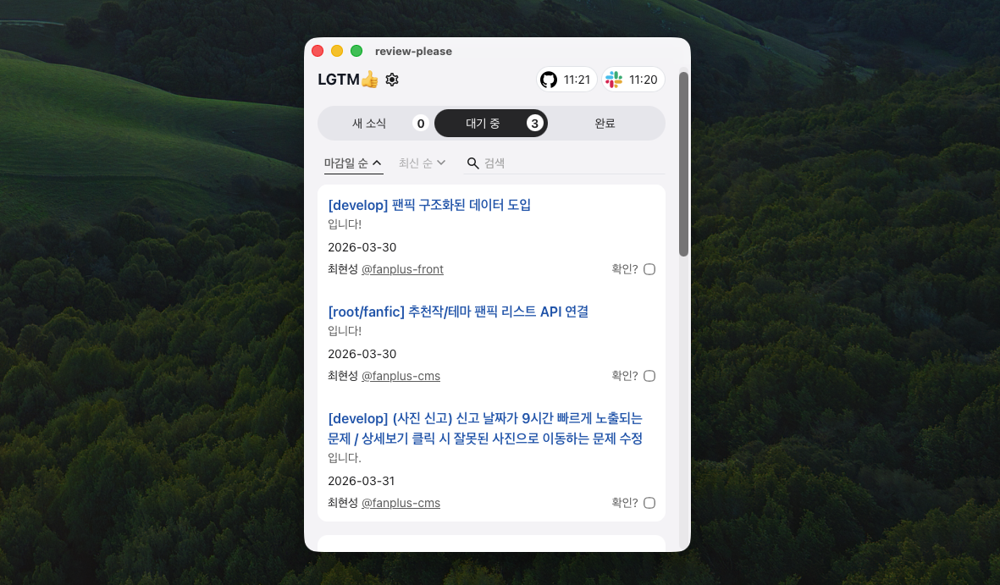

# review-please

Slack 멘션을 기반 PR 리뷰 요청을 추적하는 Tauri 앱.

## 주요 기능

- **새 소식**
  - Github 알림 중 나와 관련있는 내용
    - 나에게 멘션, 내 PR에 달린 코멘트, 내 PR Approve 등
- **대기 중**
  - 아직 Approve하지 않았고, 머지되지 않은 PR들
- **완료**
  - 내가 Approve했거나 머지한 PR들

## 작동 방식

1. 슬랙에서 특정 키워드를 포함한 메시지를 주기적으로 검색
2. 메시지를 파싱
3. 요청받은 PR 리뷰 링크 및 기한 등을 목록화

## 설치

1. [최신 릴리즈](https://github.com/sycha-front/review-please/releases)에서 `.dmg` 파일 설치
2. 하단 설정 메뉴에서 필수 설정 입력
   > 모든 정보는 클라이언트에만 저장됩니다.

- 알림받을 slack 멘션 키워드
- slack 유저명
- github 유저명
- slack 유저 토큰
  - 개발자 문의 또는 [노션](https://www.notion.so/revplz-330be0fd70d780a8bcdad7a72c79e1f4?source=copy_link) 확인
- github 유저 토큰 (classic)
  - Github Settings > 최하단 Developer settings > Personal access tokens (classic) > repo, notification 허용

## 업데이트

새 버전을 자동으로 탐색, 감지되면 헤더에서 업데이트 가능 표시됨

## ETC

- macOS 보안 경고가 뜨면 첫 실행 시 Finder에서 앱 우클릭 후 `열기`로 허용
