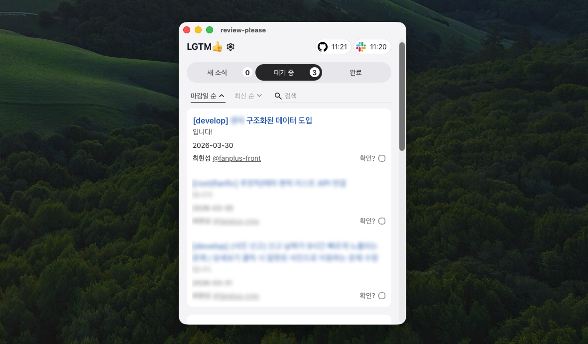

# review-please

Slack 멘션을 기반으로 PR 리뷰 요청과 알림을 추적하는 MacOS 트레이 앱.

## 주요 기능

- **새 소식**
  - Github 알림 중 나와 관련있는 내용
    - 나에게 멘션, 내 PR에 달린 코멘트, 내 PR Approve 등
- **대기 중**
  - 아직 Approve하지 않았고, 머지되지 않은 PR들
  - 대괄호(`[]`) 안의 날짜 표시를 기반으로 마감일을 파싱 (3/14, 3.15, 금일, 명일 등)
- **완료**
  - 내가 Approve했거나 머지한 PR들

## 작동 방식

- **새 소식**
  - Github에서 내 알림과 연결된 PR 이벤트를 불러와요.
  - 그중에서 나와 관련 있는 변화만 보여줘요.
  - 예: 나에게 온 멘션, 내 PR에 달린 코멘트, 내 PR의 approve, changes requested

- **대기 중**
  - Slack에서 설정한 멘션 키워드가 들어간 메시지를 주기적으로 불러와요.
  - 메시지 안에서 Github PR 링크를 찾아 리뷰 요청으로 등록해요.
  - 그중에서 아직 내가 approve하지 않았고, merge되지 않은 PR을 보여줘요.
  - 메시지 안의 대괄호(`[]`) 날짜가 있으면 마감일도 함께 읽어요.

- **완료**
  - 리뷰 요청으로 들어온 PR 중에서 이미 끝난 건을 보여줘요.
  - 예: 내가 approve한 PR, 이미 merge된 PR, 기한이 많이 지난 PR

## 설치

1. [최신 릴리즈](https://github.com/sycha-front/review-please/releases)에서 `.dmg` 파일 설치
2. 터미널에 `xattr -dr com.apple.quarantine "/Applications/review-please.app"` 실행 (애플의 커스텀 앱 제한 우회)
3. 하단 설정 메뉴에서 필수 설정 입력
   > 모든 정보는 클라이언트에만 저장됩니다.

- [x] 알림받을 slack 멘션 키워드
- [x] Slack 연결
  - 버튼을 누르면 브라우저에서 Slack 권한 승인 후 자동 연결됩니다.
- [ ] slack 유저 토큰
  - 기본적으로는 필요 없고, 고급 옵션에서만 사용하는 수동 입력용 fallback 입니다.
- [ ] slack 유저명
  - 보통은 Slack 연결 시 자동으로 채워집니다.
- [x] github 유저 토큰 (classic)
  - Github Settings > 최하단 Developer settings > Personal access tokens (classic) > `repo`, `notification` 권한 허용
  - Github 유저명은 토큰으로 자동 인식됩니다.

## 업데이트

새 버전을 자동으로 탐색, 감지되면 헤더에서 업데이트 가능 표시됨

## ETC

- macOS 보안 경고가 뜨면 첫 실행 시 Finder에서 앱 우클릭 후 `열기`로 허용
